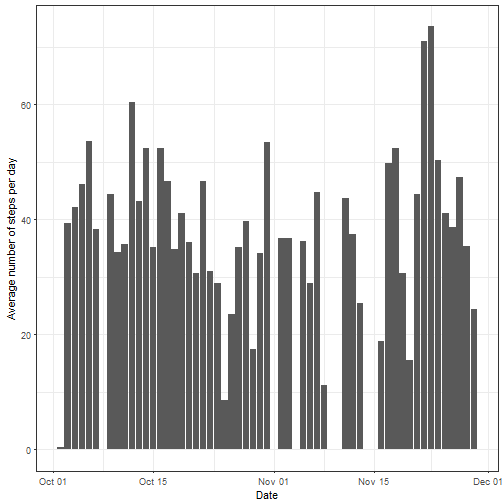

## Code for reading in the dataset and/or processing the data


```r
library(readr)
download.file("https://d396qusza40orc.cloudfront.net/repdata%2Fdata%2Factivity.zip", "../data/repdata_data_activity.zip")
unzip(zipfile="../data/repdata_data_activity.zip", exdir="../data")
activity <- read_csv("../data/activity.csv")
```

```
## Parsed with column specification:
## cols(
##   steps = col_integer(),
##   date = col_date(format = ""),
##   interval = col_integer()
## )
```

```r
#nrow(activity)
#head(activity,10)
```
Dataset used: **Activity monitoring data**

The variables included in this dataset are:  
- steps: Number of steps taking in a 5-minute interval (missing values are coded as NA)  
- date: The date on which the measurement was taken in YYYY-MM-DD format  
- interval: Identifier for the 5-minute interval in which measurement was taken  

The dataset is stored in a comma-separated-value (CSV) file and there are a total of 17,568 observations in this dataset.

## Histogram of the total number of steps taken each day

```r
# Load libraries
library(data.table)
library(ggplot2)

# Read data
dt <- data.table(activity)
head(dt)
```

```
##    steps       date interval
## 1:    NA 2012-10-01        0
## 2:    NA 2012-10-01        5
## 3:    NA 2012-10-01       10
## 4:    NA 2012-10-01       15
## 5:    NA 2012-10-01       20
## 6:    NA 2012-10-01       25
```

```r
aggregates <- dt[,list(totalStepsPerDay=sum(steps, na.rm=TRUE), meanStepsPerDay=mean(steps, na.rm=TRUE), medianStepsPerDay=median(steps, na.rm=TRUE)), by=date]
head(aggregates)
```

```
##          date totalStepsPerDay meanStepsPerDay medianStepsPerDay
## 1: 2012-10-01                0             NaN                NA
## 2: 2012-10-02              126         0.43750                 0
## 3: 2012-10-03            11352        39.41667                 0
## 4: 2012-10-04            12116        42.06944                 0
## 5: 2012-10-05            13294        46.15972                 0
## 6: 2012-10-06            15420        53.54167                 0
```

```r
# Plot data
p1 <- ggplot(aggregates) + geom_bar(aes(x=date,y=totalStepsPerDay), stat="identity") + theme_bw() + xlab("Date") + ylab("Total number of steps per day")
p1
```


## Mean and median number of steps taken each day

```r
df <- data.frame(aggregates$date,aggregates$meanStepsPerDay,aggregates$medianStepsPerDay )
colnames(df)<- c("Date","Mean","Median")
head(df)
```

```
##         Date     Mean Median
## 1 2012-10-01      NaN     NA
## 2 2012-10-02  0.43750      0
## 3 2012-10-03 39.41667      0
## 4 2012-10-04 42.06944      0
## 5 2012-10-05 46.15972      0
## 6 2012-10-06 53.54167      0
```


## Time series plot of the average number of steps taken

```r
# Plot aggregated data (without NA values)
p1 <- ggplot(na.omit(aggregates)) + geom_bar(aes(x=date,y=meanStepsPerDay), stat="identity") + theme_bw() + xlab("Date") + ylab("Average number of steps per day")
p1
```



## The 5-minute interval that, on average, contains the maximum number of steps

```r
# Load library
library(dplyr)
library(sqldf)

# Aggregate data
# Calculate first average (mean) number of steps taken per interval
aggregates1 <- dt[,list(meanStepsPerInterval=mean(steps, na.rm=TRUE)), by=interval]
# Then select interval with maximum average number of steps taken
maxMeanStepsPerInterval <- sqldf('select interval, max(meanStepsPerInterval) from aggregates1')
maxMeanStepsPerInterval
```

```
##   interval max(meanStepsPerInterval)
## 1      835                  206.1698
```


## Code to describe and show a strategy for inputing missing data

```r
# Check for missing values
sapply(dt, function(x) sum(is.na(x)))
```

```
##    steps     date interval 
##     2304        0        0
```

```r
# compared to non-missing values
sapply(dt, function(x) sum(!is.na(x)))
```

```
##    steps     date interval 
##    15264    17568    17568
```
Observations:  
* Only values for steps are missing.

Strategy for replacement of missing values:  
* Assign mean value of steps per interval to all rows where steps = NA   


```r
# Original activity data set with NA values
dt1 <- dt
# Create new data set with cols interval and steps, where steps = average steps taken per interval (excluding NA values)
dt2 <- dt1[,list(steps=mean(steps, na.rm=TRUE)), by=interval]
head(dt2)
```

```
##    interval     steps
## 1:        0 1.7169811
## 2:        5 0.3396226
## 3:       10 0.1320755
## 4:       15 0.1509434
## 5:       20 0.0754717
## 6:       25 2.0943396
```

```r
# Replace NA values for steps with average number of steps mapped by interval
dt1$steps[which(is.na(dt1$steps))] <- dt2$steps
head(dt1)
```

```
##        steps       date interval
## 1: 1.7169811 2012-10-01        0
## 2: 0.3396226 2012-10-01        5
## 3: 0.1320755 2012-10-01       10
## 4: 0.1509434 2012-10-01       15
## 5: 0.0754717 2012-10-01       20
## 6: 2.0943396 2012-10-01       25
```

## Histogram of the total number of steps taken each day after missing values are imputed. Calculate and report the mean and median total number of steps taken per day. 

```r
# Aggregate data in new data set without NA values
aggregates2 <- dt1[,list(totalStepsPerDay=sum(steps, na.rm=TRUE), meanStepsPerDay=mean(steps, na.rm=TRUE), medianStepsPerDay=median(steps, na.rm=TRUE)), by=date]
head(aggregates2)
```

```
##          date totalStepsPerDay meanStepsPerDay medianStepsPerDay
## 1: 2012-10-01         10766.19        37.38260          34.11321
## 2: 2012-10-02           126.00         0.43750           0.00000
## 3: 2012-10-03         11352.00        39.41667           0.00000
## 4: 2012-10-04         12116.00        42.06944           0.00000
## 5: 2012-10-05         13294.00        46.15972           0.00000
## 6: 2012-10-06         15420.00        53.54167           0.00000
```

```r
# Verify by checking for missing values
sapply(dt1, function(x) sum(is.na(x)))
```

```
##    steps     date interval 
##        0        0        0
```

```r
# Plot aggregated data
p3 <- ggplot(aggregates2) + geom_bar(aes(x=date,y=totalStepsPerDay), stat="identity") + theme_bw() + xlab("Date") + ylab("Total number of steps per day")
p3
```


```r
# Summarize aggregated data sets
summary(aggregates)
```

```
##       date            totalStepsPerDay meanStepsPerDay   medianStepsPerDay
##  Min.   :2012-10-01   Min.   :    0    Min.   : 0.1424   Min.   :0        
##  1st Qu.:2012-10-16   1st Qu.: 6778    1st Qu.:30.6979   1st Qu.:0        
##  Median :2012-10-31   Median :10395    Median :37.3785   Median :0        
##  Mean   :2012-10-31   Mean   : 9354    Mean   :37.3826   Mean   :0        
##  3rd Qu.:2012-11-15   3rd Qu.:12811    3rd Qu.:46.1597   3rd Qu.:0        
##  Max.   :2012-11-30   Max.   :21194    Max.   :73.5903   Max.   :0        
##                                        NA's   :8         NA's   :8
```

```r
summary(aggregates2)
```

```
##       date            totalStepsPerDay meanStepsPerDay   medianStepsPerDay
##  Min.   :2012-10-01   Min.   :   41    Min.   : 0.1424   Min.   : 0.000   
##  1st Qu.:2012-10-16   1st Qu.: 9819    1st Qu.:34.0938   1st Qu.: 0.000   
##  Median :2012-10-31   Median :10766    Median :37.3826   Median : 0.000   
##  Mean   :2012-10-31   Mean   :10766    Mean   :37.3826   Mean   : 4.474   
##  3rd Qu.:2012-11-15   3rd Qu.:12811    3rd Qu.:44.4826   3rd Qu.: 0.000   
##  Max.   :2012-11-30   Max.   :21194    Max.   :73.5903   Max.   :34.113
```
Question: Do these values (total, mean and median) differ from the estimates from the first part of the assignment?  
Answer:  The values differ with regard to totalStepsPerDay and mediaStepsPerDay. As missing (NA) values have been replaced with mean value, there is no difference for (min, max, mean, median of) meanStepsPerDay.

Question: What is the impact of imputing missing data on the estimates of the total daily number of steps?  
Answer:  The toal number of steps is naturally higher for the data set with replaced NA values than for the data set having NA values. The same applies for min, mean and median. Mean and Median values of totalStepsPerDay are equal after replacing missing (NA) values 


## Panel plot comparing the average number of steps taken per 5-minute interval across weekdays and weekends

```r
# Add new column with weekday to original data set
dt$wday <- format(as.Date(dt$date), "%a")
head(dt)
```

```
##    steps       date interval wday
## 1:    NA 2012-10-01        0  Mon
## 2:    NA 2012-10-01        5  Mon
## 3:    NA 2012-10-01       10  Mon
## 4:    NA 2012-10-01       15  Mon
## 5:    NA 2012-10-01       20  Mon
## 6:    NA 2012-10-01       25  Mon
```

```r
# Create vector with weekdays
weekdays1 <- c('Monday', 'Tuesday', 'Wednesday', 'Thursday', 'Friday')
dt$wday <- factor((weekdays(dt$date) %in% weekdays1), 
         levels=c(TRUE, FALSE), labels=c('weekday', 'weekend'))

# Aggregate data: Average number of steps per interval across weekdays / weekends
aggregates4 <- sqldf('select interval, wday, avg(steps) meanStepsPerInterval from dt group by interval, wday')
head(aggregates4)
```

```
##   interval    wday meanStepsPerInterval
## 1        0 weekday            2.3333333
## 2        0 weekend            0.0000000
## 3        5 weekday            0.4615385
## 4        5 weekend            0.0000000
## 5       10 weekday            0.1794872
## 6       10 weekend            0.0000000
```

```r
# Multiple plot of data
p <- ggplot(aggregates4, aes(interval, meanStepsPerInterval)) + geom_point()
p + facet_grid(. ~ wday)
```


## All of the R code needed to reproduce the results (numbers, plots, etc.) in the report


